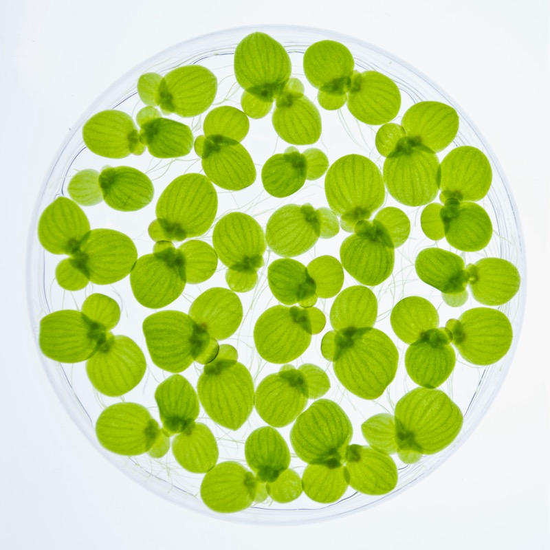
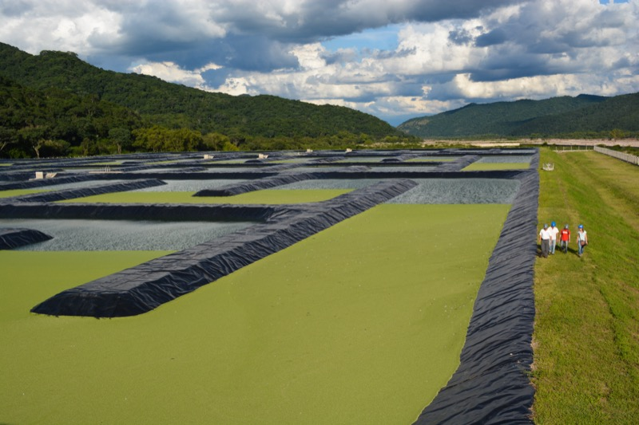
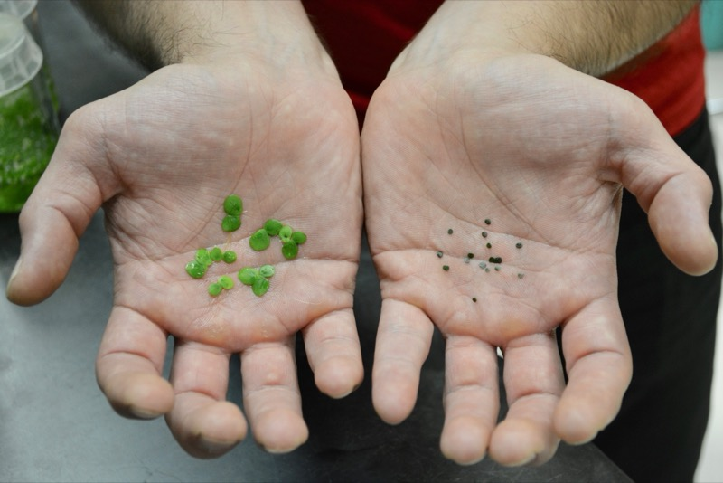
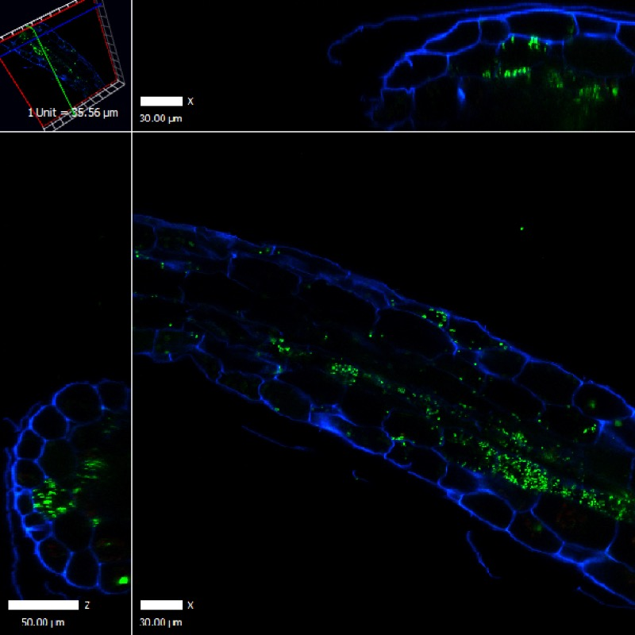
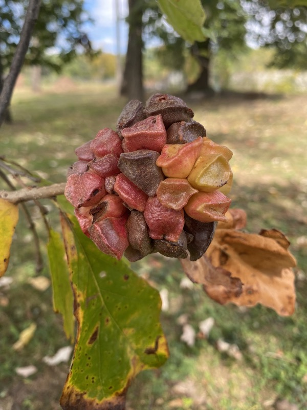

<button type="button" data-bs-target="#researchCarousel" data-bs-slide-to="0" class="active"></button>
<button type="button" data-bs-target="#researchCarousel" data-bs-slide-to="1"></button>
<button type="button" data-bs-target="#researchCarousel" data-bs-slide-to="2"></button>
<button type="button" data-bs-target="#researchCarousel" data-bs-slide-to="3"></button>
<button type="button" data-bs-target="#researchCarousel" data-bs-slide-to="4"></button>

<button class="carousel-control-prev" type="button" data-bs-target="#researchCarousel" data-bs-slide="prev">

</button>
<button class="carousel-control-next" type="button" data-bs-target="#researchCarousel" data-bs-slide="next">

</button>

Welcome to the webpage of Kenneth Acosta, PhD.

